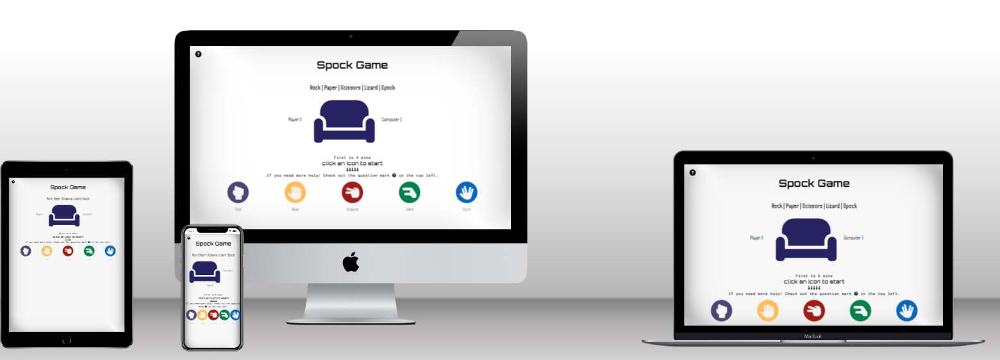
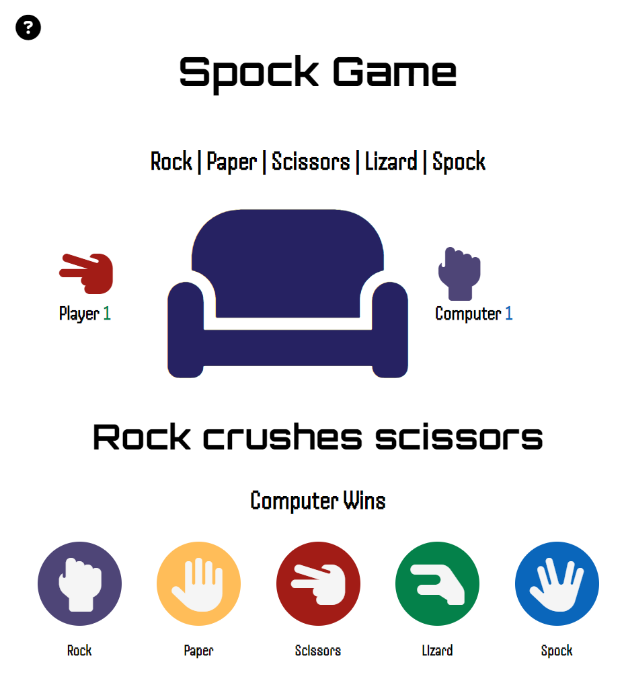
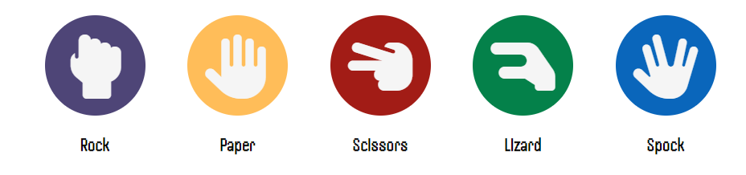
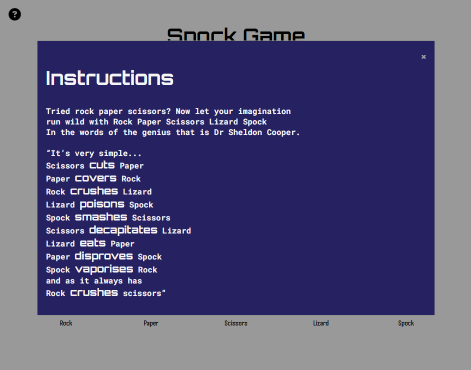
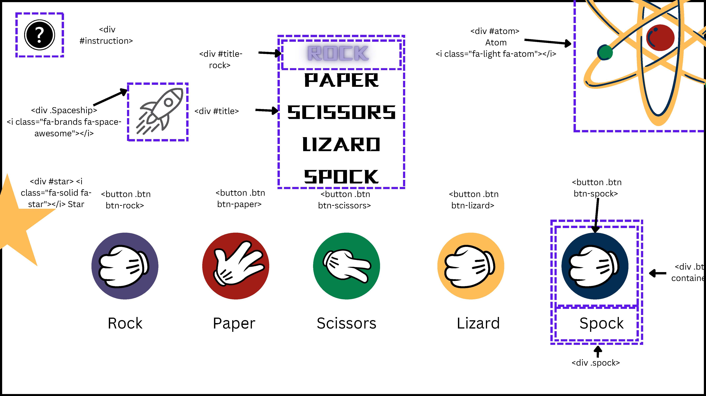
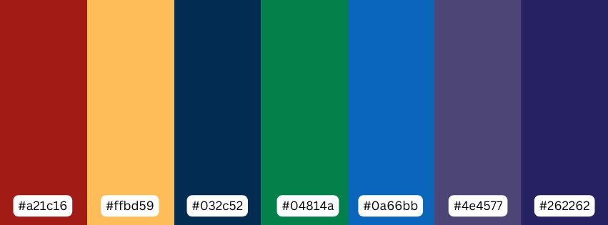
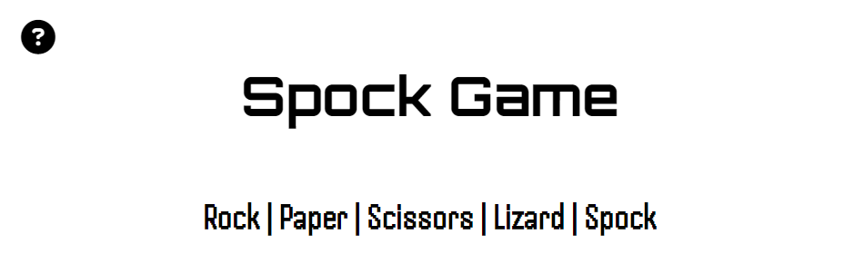

# Spock Game 
## Rock  | Paper | Scissors | Lizard | Spock
Taking the game Rock, Paper, Scissors to a new level with famous adaptations featured on The Big Bang Theory.

This game of chance pits the user against the computer to see who can be the first to reach 5 points. It offers an interactive experience with 10 possible outcomes.

[Visit the live project](https://kash-dotcom.github.io/spock-game/)

## Target Audience
* Fans of The Big Bang Theory who have always wanted to play Rock, Paper, Scissors, Lizard, Spock.
* Those who enjoy playing mobile games and are looking for a short game to pass the time.

## User Stories

* **First-time users** Should be able to start the game with little instruction.
* **Returning visitors** Those with natural curiosity about how the game will develop, especially with the introduction of Easter eggs.
* **Frequent users** Those who enjoyed the game the first time and are looking for a stress release.

# Features
The game is for people who enjoy the Big Bang Theory, and Star Trek and have nostalgic memories of computer games of the 80’s. It pays homage to the television shows with the Star Trek and space invaders fonts as well as the sofa. 

## Title 
* A short **heading** so it is easier to find and remember for repeat and frequent users. 
* **Subheading** – explains exactly what it is and will have recognition for the majority of western people who would have played the game when they were younger.

## Sofa & Scores
Fans of The Big Bang Theory will recognizse the significance of the characters often gathered on the sofa, which serves as the focal point on the show. Similarly, this game places importance on a central spot where activity happens around it.  

In the mobile version the scores are kept underneath the sofa and are hidden when the games begins

* **Hand** gestures to indicate what the player and user have submitted
* **Outcome** – so users can understand why a game has been won or lost

## Selection Buttons
* The users can select the hand gesture they wish to play

## Modal
An instructions modal is provided so users can see all the different options. This modal includes a quote from The Big Bang Theory explaining the rules, which can be accessed by clicking on the question mark icon. Using familiar iconography, this helps users understand that they can seek help by clicking on it. The modal can be closed by either clicking outside it or using the close button.

## Future Features

* Add more animations, such as visual representations of "Rock crushes Scissors".
* Include an Easter egg where users can click on "Sheldon’s Spot" to access more content.
* Implement hover-over colours that are a slightly deeper shade to indicate to desktop users what they can select.
* Simplify the code using more loops, iterations, and arrays.

## User Experience 

In a game a chance, users are allowed to try their luck to beat the computer. The design allows users to understand what the game is and how to play without leaving the browser. Although are words, it is possible to use the game with limited English. 

# Design
Canva was used to make a mock-up that included wireframe and design elements. This mock-up helped to decide the layout, divisions, IDs, classes, and colour scheme. 

## Colour Palette

The colours are taken from a still image of The Big Bang Theory. When the player selects one of the buttons, it is shown above the scorecard with a cut-out version, using the same colours of the buttons but in reverse.

## Typography 

Three Google fonts are used in the project:
* **Font Awesome** Used for all icons and symbols for their simplicity and consistency.

* **Orbitron** giving it a Star Trek-like feel.
* **Handjet** with its pixelated look resembling the poor-quality graphics of the 80s, suiting the characters of The Big Bang Theory.
* **Roboto Mono** an easy-to-read font that allows users to read about the game’s origin and look at the 10 different possible outcomes.

# Technologies Used
## Coding Languages
* HTML
* CSS3
* JavaScript

# External Resources

## Known Bugs
* Once a player reaches 5 points, they can continue to play, and the winning message will change. There is currently no upper limit to the game.
* The game title is not included once gameplay begins, but this does not affect the gameplay.

## Testing

### Manual Testing
* Three monitors were used to 
    * 1220 x 570px 
    * 1137 x 674px 
    * 2560 x 1440px
* Google Pixel 7

* **Gemini Ai** was used to check the function of any input code and ensure they were aligned to the developer’s purpose. Also, it was used as a coach to move throught the debugging process. If code was suggested it was not used in the project. 
* **Human-testers** Two avid mobile game plauers were used leading to changes in the modal and added gameplay instructions on the landing page.

## Frameworks, libraries & programs used
* **Gitpod** - To facilitate the writing of code
* **Git** – to support version control
* **Github** to deploy the website
* **Google Fonts** – supply the fonts for the whole site
* **Cloudinary** to facilitate mockup images included in the
* **Fonts Awesome** for social media logos#
* **site-shot** for taking screenshot of the whole website 

### Code Validation
The game has been frequently tested using Dev Tools for CSS, HTML, and JavaScript. Code validation tools used include:

* **JHint** Passed with 34 warnings related to the usage of ‘let’, ‘const’, and ‘template literal syntax’, which are available in ES6 (use 'version: 6').
* **Jigsaw w3** Passed with two warnings related to family names containing whitespace.
* **validator.w3** Passed with no warnings or errors.

## CSS
The CSS code passed validation using the W3C CSS Validator and no errors were found. However, there was two warnings related to family names containing whitespace.

## HTML
Passed with no warnings or errors.

* [Desktop Analysis](https://res.cloudinary.com/ddqlomb2x/image/upload/v1727395651/lighthouse_desktop_Page_1_iwov9j.jpg)

- [ Mobile Analysis](https://asset.cloudinary.com/ddqlomb2x/525dab120879a6aab951f81879d6566c)

## Deployment
Lock into GibHub and locate the repository for [repository for Spock Game](https://github.com/kash-dotcom/spock-game)

1. Along the navigation bar locate settings
2. Scroll down the page and on the left-hand side navigation bar you will find Page
3. Under the Build and Deployment you will find "Source" and a drop-down menu None" select "Main" and click "Save".
4. The page will automatically refresh.
5. Scroll back to locate the now-published site link in the "GitHub Pages" section.

# Credits and Acknowledgements
* [Creating a modal](https://www.w3schools.com/howto/howto_css_modals.asp*/)

* [Visability hidden onload](https://www.reddit.com/r/learnjavascript/comments/aw5l96/how_do_i_change_the_display_or_visibility/)

* [Computer selecting a random from an array](https://www.geeksforgeeks.org/how-to-select-a-random-element-from-array-in-javascript/)

* W3school and MDN Web Docs

* Code Institutes lessons

* Stackoverflow and Slack Community

# Content
Copilot was used for proofreading. 

# Acknowledgements
The two former students who shared their previous projects gave me the inspiration and belief that the game was possible to create. 